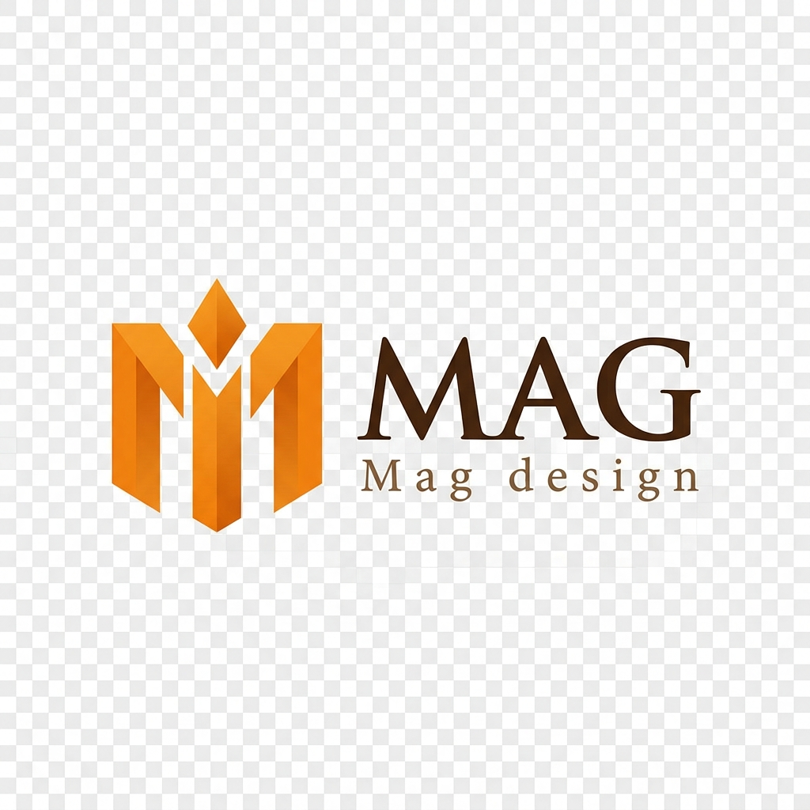

# MAG Design - Luxury Interior Design Studio

Welcome to the **MAG Design** platform! This is a premium, bilingual (English/Arabic) web application built for a luxury interior architecture studio. It serves as both a high-end portfolio and a secure client portal for tracking project progress.



## 🌟 Key Features

### 1. Bilingual Support (RTL/LTR)
- Full support for English and Arabic.
- Dynamic layout flipping (RTL for Arabic, LTR for English) using Tailwind CSS and Zustand state management.
- Seamless, instant language switching without page reloads.

### 2. Luxury UI/UX Design
- **Modern Aesthetics**: Rich, dark-mode inspired sections combined with clean, breathable white spaces.
- **Micro-interactions**: Smooth hover effects, glassmorphism, and dynamic scrolling experiences powered by Framer Motion.
- **Responsive**: Fully optimized for mobile, tablet, and desktop viewing.

### 3. Public Website
- **Home**: An immersive hero section, services preview, and portfolio highlights.
- **Portfolio**: A beautiful masonry grid showcasing past projects with filtering capabilities.
- **Project Details**: Deep dives into specific projects with full-screen photo lightboxes.
- **Services**: Detailed breakdowns of design, execution, and finishing offerings.
- **Booking Flow**: A multi-step consultation booking form.

### 4. Client Portal
- **Secure Access**: A private login area for active clients.
- **Dashboard**: Real-time progress tracking of project phases (Design, Execution, Handover).
- **Documents**: Secure viewing and downloading of contracts, plans, and invoices.
- **Site Gallery**: Live photo updates from the construction site.
- **Direct Messaging**: A built-in chat interface to communicate directly with the design and supervision team.

## 🛠 Tech Stack

- **Framework**: [Next.js 14](https://nextjs.org/) (App Router)
- **Styling**: [Tailwind CSS](https://tailwindcss.com/)
- **Animations**: [Framer Motion](https://www.framer.com/motion/)
- **Icons**: [Lucide React](https://lucide.dev/)
- **State Management**: [Zustand](https://github.com/pmndrs/zustand)
- **Language**: TypeScript

## 🚀 Getting Started

### Prerequisites
Make sure you have [Node.js](https://nodejs.org/) installed on your machine.

### Installation
1. Clone the repository:
   ```bash
   git clone https://github.com/mohammed-abdelwhab/MAG-Design.git
   ```
2. Navigate into the project directory:
   ```bash
   cd MAG-Design
   ```
3. Install dependencies:
   ```bash
   npm install
   ```
4. Start the development server:
   ```bash
   npm run dev
   ```
5. Open [http://localhost:3000](http://localhost:3000) in your browser to view the application.

## 🧪 Testing the Client Portal
To test the secure client portal, navigate to `http://localhost:3000/login` and use the following demo credentials:
- **Client Code**: `MAG2024`
- **Password**: `password123`

## 📦 Deployment
This project is optimized for deployment on [Vercel](https://vercel.com/).
1. Import the GitHub repository into your Vercel account.
2. The framework preset will automatically be detected as Next.js.
3. Click **Deploy**.

---
*Designed and built with precision and luxury in mind.*
